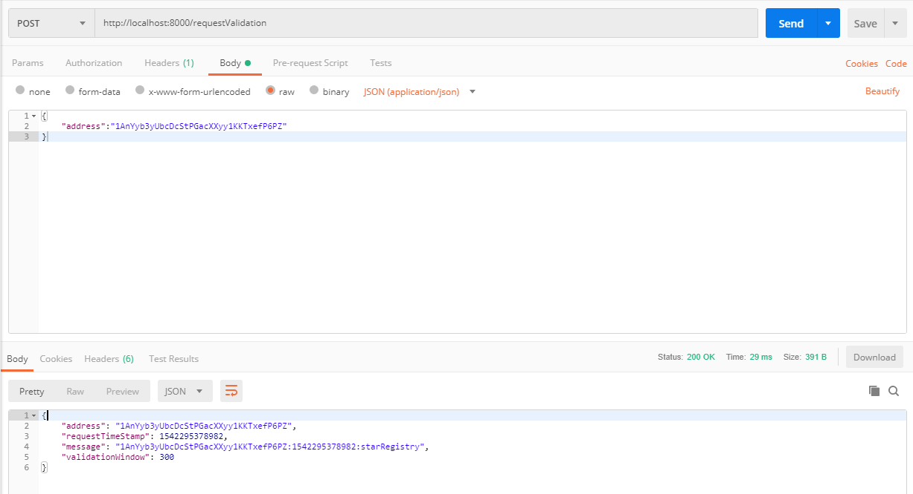
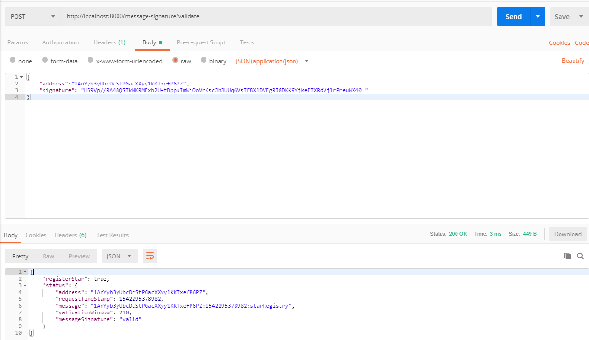
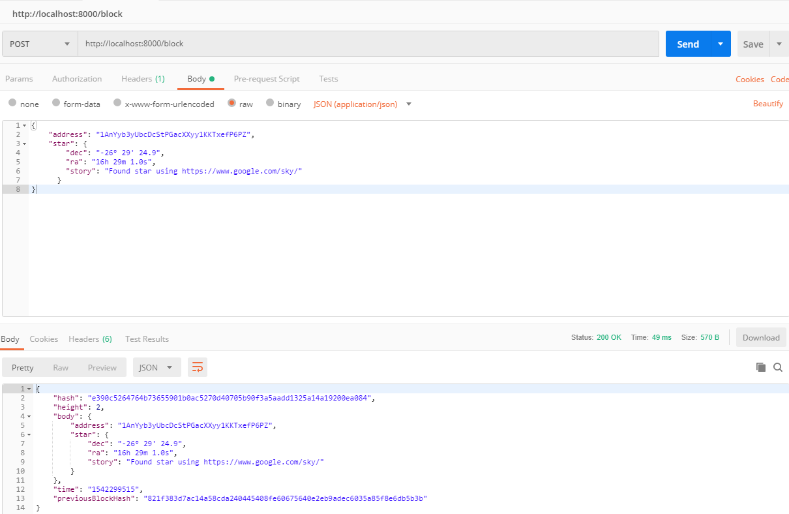
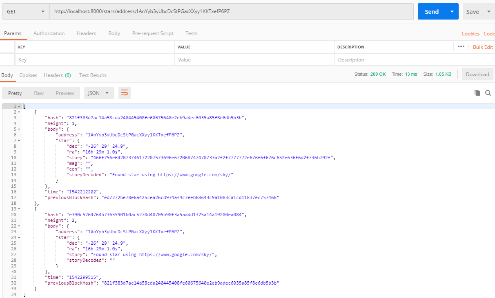
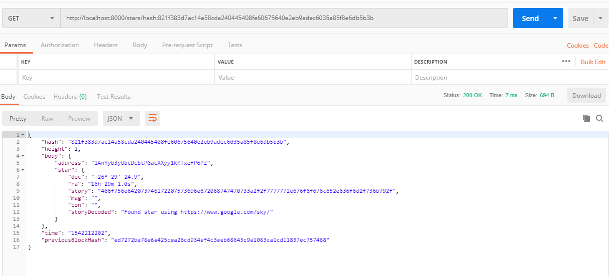
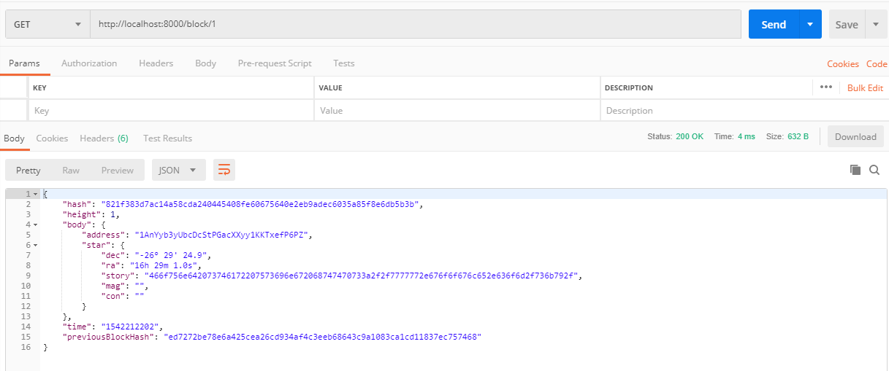

# The Private Blockchain Notary Service

## Node.js Framework
- Express

## Getting started

Open a command prompt or shell terminal after install node.js and execute:

```
npm install
```

then

```
node app.js
```

## Testing

### 1. Validation request

**Method**

```
POST
```

**Endpoint**

```
http://localhost:8000/requestValidation
```

**Parameters**

```
address - A bitcoin address
```

**Example**



### 2. Message signature validation

**Method**

```
POST
```

**Endpoint**

```
http://localhost:8000/message-signature/validate
```

**Parameters**

```
address - A bitcoin address
signature - You can take it from the Electrum wallet
```

**Example**



### 3. Star registration

**Method**

```
POST
```

**Endpoint**

```
http://localhost:8000/block
```

**Parameters**

```
address - A bitcoin address
star - Containing dec, ra and story (max 500 bytes)
```

**Example**



### 4. Get block by address

**Method**

```
GET
```

**Endpoint**

```
http://localhost:8000/stars/address:address
```

**Parameters**

```
address - A bitcoin address
```

**Example**



### 5. Get block by hash

**Method**

```
GET
```

**Endpoint**

```
http://localhost:8000/stars/hash:hash
```

**Parameters**

```
hash - A block hash
```

**Example**



### 6. Get block by height

**Method**

```
GET
```

**Endpoint**

```
http://localhost:8000/block/:height
```

**Parameters**

```
height - The height of block
```

**Example**

